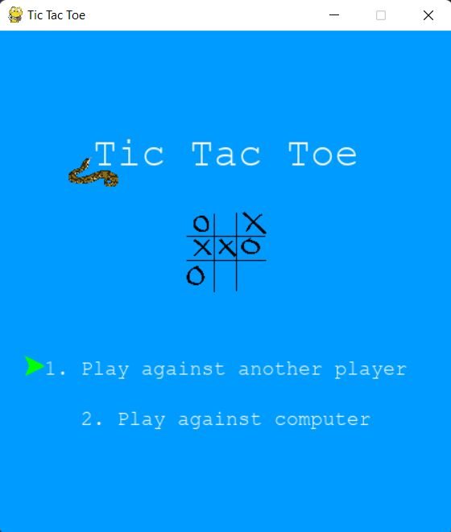

# Tic Tac Toe with PyGame

This Tic Tac Toe game is improved from the tutorial in [How to Build a Tic Tac Toe Game in Python](https://www.thepythoncode.com/article/make-a-tic-tac-toe-game-pygame-in-python)

Python version: 3.11.4

Package to install: `pygame`

Some functionalities I added:
1. Player is able to choose to play with a human locally or with a comp
2. Player is able to choose whether to go first or second when playing against a comp
3. After finishing the game, player is able to reset the environment and start from the beginning again

Some minor things that I added in:
1. PLayer is able to choose the option either using:
    a. "1" or "2" key in keyboard
    b. Arrow up, down, and enter key
2. An arrow is used to determine the current position of chosen option if the player were to choose using arrow button instead of the numbers directly

Several problems I encountered:
1. I am a bit confused about the python interpreter and things because I have several version of python in my system. When I change IDE from PyCharm to VSCode, I have a little bit of problem when trying to run the file
2. I also was confused about the need of python environment (where I usually create using `venv`). The environment is useful if you want a fixed python environment and packages ready to run that specific python file. Rather than relying on the environment of each system. Hence, I believe that python environment is useful if you want the python file to work properly no matter where it is launched (I hope my understanding is correct).
